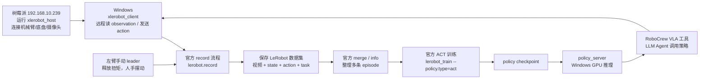

# 官方 VLA ACT 从采集到训练再到执行教学教程

本文记录我们当前这套 XLeRobot host-client 路线的完整流程：树莓派只负责连接硬件和运行 host，Windows 高性能电脑负责录制、整理数据、训练 ACT policy、启动 policy server，并通过 RoboCrew/LLM Agent 调用训练好的策略执行任务。

当前任务示例：

> Pick up the red Coca-Cola can from the table and place it on the robot shelf.

中文理解就是：把桌面上的红色可口可乐空罐拿起来，放到机器人自身置物架上。

## 1. 当前路线总览

这条路线尽量走官方 LeRobot/XLeRobot/VLA_ACT/RoboCrew 的结构，只在 host-client 场景下加了很薄的适配层。



重点：

- 树莓派不训练，不跑大模型，只做硬件控制器。
- Windows 负责高算力部分：录制入口、数据处理、训练、推理服务、LLM Agent。
- 我们没有 VR 设备，所以不用 `xlerobot_vr`；改用左臂当 leader，右臂当 follower 采集示范数据。
- 这次训练数据里的执行动作是右臂动作，因为我们是“手动摆左臂，自动同步到右臂并记录右臂动作”。

## 1.1 目录结构说明

先把目录搞清楚，后面才知道命令为什么这样写、数据为什么出现在那些位置。

### Windows 工作目录

当前 Windows 主工作目录是：

```text
E:\lerobot
```

它既放官方代码，也放我们自己的教学脚本、数据集、训练输出和缓存。

推荐理解成这样：

```text
E:\lerobot
├── lerobot\
│   └── src\lerobot\                         # LeRobot / XLeRobot 主要源码
├── XLeRobot\                                # XLeRobot 官方仓库和示例资料
├── robocrew_client_agent\                   # 我们整理的 RoboCrew / VLA / 教学脚本
├── host_client_examples\                    # 早期 host-client 控制示例和实验脚本
├── datasets\                                # 采集出来的 LeRobot 数据集
├── outputs\train\                           # ACT 训练输出和 checkpoint
├── envs\lerobot-gpu\                        # Windows Python GPU 环境
├── calibration\                             # Windows 侧校准文件目录
├── hf_cache\                                # Hugging Face 缓存
├── hf_datasets_cache\                       # datasets 缓存
├── lerobot_home\                            # LeRobot 运行缓存
└── torch_cache\                             # PyTorch 模型缓存
```

这些目录的作用：

| 目录 | 作用 | 能不能删除 |
|---|---|---|
| `E:\lerobot\lerobot` | LeRobot 主代码。我们运行 `python -m lerobot.record`、`lerobot_train` 都依赖它。 | 不要删。 |
| `E:\lerobot\XLeRobot` | XLeRobot 官方仓库，里面有官方示例、VR 工具、文档对应代码。 | 不要删，后面经常参考。 |
| `E:\lerobot\robocrew_client_agent` | 我们当前最重要的教学和 Agent 工作区。里面放录制脚本、训练脚本、VLA 工具模板、说明文档。 | 不要删。 |
| `E:\lerobot\host_client_examples` | 早期键盘、手柄、YOLO、LLM 控制实验脚本。可以参考，但不是当前 VLA 主线。 | 暂时保留。 |
| `E:\lerobot\datasets` | 所有采集数据、合并数据都在这里。训练直接读这里。 | 不要乱删，尤其是有效 episode。 |
| `E:\lerobot\outputs\train` | 训练结果和 checkpoint。执行 policy 时要填这里的 checkpoint 路径。 | 不要删最新有效模型。 |
| `E:\lerobot\envs\lerobot-gpu` | Windows GPU Python 环境。缺包、版本都和它有关。 | 不要删，除非重装环境。 |
| `E:\lerobot\calibration` | Windows 客户端校准目录。 | 保留。 |
| `E:\lerobot\hf_cache` | Hugging Face 模型缓存。 | 可清理，但会导致下次重新下载。 |
| `E:\lerobot\hf_datasets_cache` | 数据集缓存。 | 可清理，但不建议训练中清理。 |
| `E:\lerobot\lerobot_home` | LeRobot 本地运行缓存。 | 一般保留。 |
| `E:\lerobot\torch_cache` | PyTorch 权重缓存。 | 可清理，但会导致下次重新下载。 |

### 当前主线脚本目录

当前最该关注的是：

```text
E:\lerobot\robocrew_client_agent
```

里面几个文件的分工：

| 文件 | 作用 |
|---|---|
| `运行官方VLA_ACT_host_client左臂leader右臂执行录制.ps1` | 录制一条 host-client leader episode。左臂手动 leader，右臂 follower。 |
| `运行官方ACT训练_可乐罐到置物架.ps1` | 用合并数据训练 ACT policy。 |
| `vla_tools_官方模板.json` | RoboCrew VLA 工具模板。训练完成后复制到用户缓存目录，并填入 checkpoint。 |
| `run_robocrew_client_agent.py` | 连续对话 Agent。后面通过它让大模型调用 VLA 工具执行任务。 |
| `检查LeRobot数据集.py` | 检查数据集字段、任务文本、视频预览。 |
| `官方VLA_ACT从采集到训练再到执行_教学教程.md` | 本教程。 |

### 数据集目录结构

每次录制会在：

```text
E:\lerobot\datasets
```

下面生成一个新的时间戳目录，例如：

```text
E:\lerobot\datasets\xlerobot_coke_can_to_shelf_leader_20260503_191733
```

一个正常 LeRobot 数据集大概是：

```text
xlerobot_coke_can_to_shelf_leader_20260503_191733
├── data\
│   └── chunk-000\
│       └── episode_000000.parquet           # 状态、动作、时间戳、episode 索引等表格数据
├── meta\
│   ├── info.json                            # 数据集总信息：fps、robot_type、features 等
│   ├── episodes.jsonl                       # 每条 episode 的元信息
│   ├── tasks.jsonl                          # 任务文本
│   └── stats.json                           # 均值方差等统计信息
└── videos\
    ├── observation.images.camera_0\         # 头部主摄像头视频
    ├── observation.images.camera_2\         # 右臂摄像头视频
    └── observation.images.head\             # 左臂摄像头视频
```

其中：

- `data/*.parquet` 是训练最核心的表格数据，包含 `action` 和 `observation.state`。
- `videos/*/*.mp4` 是视觉输入，ACT 会从这里读图像。
- `meta/info.json` 记录字段结构，告诉训练程序每个 observation/action 是什么形状。
- `meta/tasks.jsonl` 记录任务文本，当前就是“拿可乐罐放到置物架”。

如果一个录制目录只有 `meta/info.json`，没有 `data` 和 `videos`，它就是失败或空数据，不应该合并训练。

### 合并数据集目录

我们把多条 episode 合并成了：

```text
E:\lerobot\datasets\xlerobot_coke_can_to_shelf_leader_merged_20260503_v2
```

训练时优先读这个目录，而不是一条一条读单独 episode 目录。

这个目录的作用：

- 集中保存当前筛选后的有效示范数据。
- 让 `lerobot_train` 一次性读取全部 episode。
- 保持任务文本、摄像头字段、action/state 维度一致。

以后如果继续录更多 episode，建议合并成新的版本，比如：

```text
E:\lerobot\datasets\xlerobot_coke_can_to_shelf_leader_merged_20260504_v1
```

不要直接覆盖旧 merged 数据。保留版本，方便对比训练效果。

### 训练输出目录

ACT 训练输出在：

```text
E:\lerobot\outputs\train
```

训练后一般会出现：

```text
E:\lerobot\outputs\train\某次训练目录
├── checkpoints\
│   ├── last\
│   │   └── pretrained_model\                # 最新 checkpoint，执行时通常填这个
│   └── 000100\                              # 按 save_freq 保存的中间 checkpoint
├── train_config.json                        # 训练配置
└── logs / 其他训练文件
```

后面执行 policy 时，`vla_tools.json` 里的 `policy_name` 要填类似：

```json
"policy_name": "E:\\lerobot\\outputs\\train\\某次训练目录\\checkpoints\\last\\pretrained_model"
```

### RoboCrew 工具配置目录

RoboCrew 默认会从用户缓存目录读取 VLA 工具配置：

```text
C:\Users\10775\.cache\robocrew\tools\vla_tools.json
```

这里不是源码目录，而是 RoboCrew 运行时读配置的地方。

我们的模板在：

```text
E:\lerobot\robocrew_client_agent\templates\vla_tools_官方模板.json
```

训练完成后要把模板复制到：

```text
C:\Users\10775\.cache\robocrew\tools\vla_tools.json
```

然后把 `policy_name` 改成真实 checkpoint，把 `active` 改成 `true`。

### 树莓派目录

树莓派上的主目录是：

```bash
/home/mh/xlerobot-dev/lerobot
```

树莓派只需要运行 host，不需要保存训练数据，也不负责训练。

常用命令：

```bash
cd ~/xlerobot-dev/lerobot
source .venv/bin/activate
python -m lerobot.robots.xlerobot.xlerobot_host
```

树莓派上的校准文件通常在：

```bash
/home/mh/.cache/huggingface/lerobot/calibration/robots/xlerobot/
```

这些校准文件决定电机零点和范围。录制和执行前要确保 host 用的是正确校准。

### 不同目录之间的数据流

可以这样记：

```text
树莓派 host
  ↓ 发送 observation / 接收 action
Windows xlerobot_client
  ↓
E:\lerobot\datasets\单条 episode 数据集
  ↓ merge
E:\lerobot\datasets\merged 数据集
  ↓ train
E:\lerobot\outputs\train\checkpoint
  ↓ 写入 vla_tools.json
C:\Users\10775\.cache\robocrew\tools\vla_tools.json
  ↓ Agent 调用
policy_server + xlerobot_client
  ↓
树莓派 host 控制真实机械臂
```

## 2. 已经改好的关键文件

这些文件是当前路线的基础，后续不要随便改回去。

| 文件 | 作用 |
|---|---|
| `E:\lerobot\lerobot\src\lerobot\record.py` | 从官方 XLeRobot record 迁入并适配当前 LeRobot，负责录制 episode。 |
| `E:\lerobot\lerobot\src\lerobot\robots\xlerobot\xlerobot_client.py` | Windows 端远程客户端，连接树莓派 host。已修正 action 记录逻辑，避免没发的关节被记录成 0。 |
| `E:\lerobot\lerobot\src\lerobot\robots\xlerobot\xlerobot_host.py` | 树莓派 host。加入 `XLEROBOT_PASSIVE_LEADER_ARM`，用于释放某条手臂扭矩做 leader。 |
| `E:\lerobot\lerobot\src\lerobot\teleoperators\remote_xlerobot_arm_leader\remote_xlerobot_arm_leader.py` | host-client leader teleop 适配器。读取远程左臂状态，映射成右臂动作。 |
| `E:\lerobot\robocrew_client_agent\scripts\powershell\运行官方VLA_ACT_host_client左臂leader右臂执行录制.ps1` | 当前推荐录制脚本。 |
| `E:\lerobot\robocrew_client_agent\scripts\powershell\运行官方ACT训练_可乐罐到置物架.ps1` | 当前推荐训练脚本。 |
| `E:\lerobot\robocrew_client_agent\templates\vla_tools_官方模板.json` | RoboCrew VLA 工具模板，训练完后填入 policy 路径。 |
| `E:\lerobot\robocrew_client_agent\run_robocrew_client_agent.py` | 连续对话 Agent，后续通过官方 RoboCrew VLA 工具调用 policy。 |

## 3. 摄像头和机械臂映射

我们已经实际测出当前 host-client observation 里的摄像头名字：

| observation key | 实际摄像头 |
|---|---|
| `camera_0` | 头部主摄像头 |
| `camera_2` | 右臂摄像头 |
| `head` | 左臂摄像头 |

当前训练录制脚本已经固定使用这三个名字。以后如果 USB 顺序变了，优先在树莓派 host 的摄像头配置里修正，不要在训练数据里混乱改名。

## 4. 录制前准备

硬件状态：

- 树莓派 IP：`192.168.10.239`
- 机器人、摄像头、串口设备都接在树莓派上。
- Windows 与树莓派处在同一个高速局域网。
- 录制时桌面上放红色可口可乐空罐。
- 机器人置物架作为放置目标。

软件状态：

- Windows Python：

```powershell
E:\lerobot\envs\lerobot-gpu\Scripts\python.exe
```

- Windows 工程根目录：

```powershell
E:\lerobot
```

- 树莓派工程根目录：

```bash
/home/mh/xlerobot-dev/lerobot
```

## 5. 启动树莓派 host

录制 leader 数据时，需要让左臂释放扭矩，左臂由人手摆动，当作 leader。

在树莓派终端运行：

```bash
cd ~/xlerobot-dev/lerobot
source .venv/bin/activate
export XLEROBOT_PASSIVE_LEADER_ARM=left
python -m lerobot.robots.xlerobot.xlerobot_host
```

含义：

- `xlerobot_host`：树莓派端官方 host，负责连接真实硬件。
- `XLEROBOT_PASSIVE_LEADER_ARM=left`：把左臂设为被动 leader，host 连接后会给左臂关节关扭矩。
- 右臂仍然保持可控，Windows 会把左臂状态映射成右臂动作。

启动后如果出现：

```text
No command available
Command not received for more than 500 milliseconds. Stopping the base.
```

这是 host 在等待 Windows 客户端命令，不是错误。

如果摄像头临时卡住，host 可能报 OpenCV frame timeout。通常重启 host 或重插摄像头即可。

## 6. 启动官方 host-client leader 录制

Windows 打开 PowerShell，进入项目根目录：

```powershell
cd E:\lerobot
```

运行我们整理好的录制脚本：

```powershell
& "E:\lerobot\robocrew_client_agent\scripts\powershell\运行官方VLA_ACT_host_client左臂leader右臂执行录制.ps1"
```

这个脚本内部实际调用的是官方 `lerobot.record` 路线：

```powershell
E:\lerobot\envs\lerobot-gpu\Scripts\python.exe -m lerobot.record `
  --robot.type=xlerobot_client `
  --robot.remote_ip=192.168.10.239 `
  --teleop.type=remote_xlerobot_arm_leader `
  --teleop.leader_arm=left `
  --teleop.follower_arm=right `
  --dataset.repo_id=local/xlerobot_coke_can_to_shelf_leader `
  --dataset.single_task="Pick up the red Coca-Cola can from the table and place it on the robot shelf." `
  --dataset.num_episodes=1 `
  --dataset.episode_time_s=20 `
  --dataset.fps=20 `
  --display_data=true
```

不用每次手打上面长命令，平时直接运行 `.ps1`。

录制时做什么：

1. 等待 `Recording episode 0`。
2. 手动摆左臂，完成一次“抓可乐罐，放到置物架”的示范动作。
3. 右臂会跟随左臂运动。
4. 系统同时记录右臂 action、机器人 state、三个摄像头视频。
5. 每次脚本默认录一条 episode，录完自动保存。

录制时建议：

- 每条 episode 只做一遍完整动作。
- 开始前尽量把可乐罐位置、机器人位置、置物架位置摆一致。
- 动作速度不要太快，夹爪开合要明显。
- 前 30 条宁愿慢一点、干净一点，不追求花样。
- 如果动作失败，那条数据不要混进训练集。

## 7. 录制结果在哪里

每跑一次录制脚本，会生成一个时间戳目录，例如：

```text
E:\lerobot\datasets\xlerobot_coke_can_to_shelf_leader_20260503_191733
```

一个完整数据集目录通常包含：

```text
data/
meta/
videos/
```

如果只有 `meta/info.json`，没有 episode 数据，那就是空数据集，不要拿来训练。

当前我们已经有一批有效 leader 数据，并合并成：

```text
E:\lerobot\datasets\xlerobot_coke_can_to_shelf_leader_merged_20260503_v2
```

当前合并数据状态：

- episode 数量：17
- 帧数：6800
- fps：20
- 摄像头：`camera_0`、`camera_2`、`head`
- 任务文本：`Pick up the red Coca-Cola can from the table and place it on the robot shelf.`

## 8. 检查单个数据集

可以用我们的小检查脚本看数据集结构和预览图：

```powershell
E:\lerobot\envs\lerobot-gpu\Scripts\python.exe `
  E:\lerobot\robocrew_client_agent\检查LeRobot数据集.py `
  E:\lerobot\datasets\某个数据集目录 `
  --save-preview
```

正常应该看到：

```text
[feature字段]
  - action
  - observation.state
  - observation.images.camera_0
  - observation.images.camera_2
  - observation.images.head
[任务] Pick up the red Coca-Cola can from the table and place it on the robot shelf.
```

如果提示没有图像字段，说明那条数据不适合 VLA 训练。

## 9. 合并多条 episode

单条 episode 不能训练出稳定策略，所以要把多条录制结果合并成一个训练数据集。

我们已经用官方 `lerobot_edit_dataset --operation.type=merge` 合并过，目标目录是：

```text
E:\lerobot\datasets\xlerobot_coke_can_to_shelf_leader_merged_20260503_v2
```

合并时的原则：

- 只合并有效 leader 数据。
- 跳过空目录。
- 不合并之前 VR 失败录出来的数据。
- 不混入早期非官方路线的实验数据。

检查合并数据集：

```powershell
E:\lerobot\envs\lerobot-gpu\Scripts\python.exe -m lerobot.scripts.lerobot_edit_dataset `
  --repo_id=local/xlerobot_coke_can_to_shelf_leader_merged `
  --root=E:\lerobot\datasets\xlerobot_coke_can_to_shelf_leader_merged_20260503_v2 `
  --operation.type=info `
  --operation.show_features=true
```

如果能看到 17 episodes、6800 frames、三个 video feature，就说明合并数据可训练。

## 10. ACT 训练

先运行小步数测试，确认训练链路没问题：

```powershell
E:\lerobot\envs\lerobot-gpu\Scripts\python.exe -m lerobot.scripts.lerobot_train `
  --dataset.repo_id=local/xlerobot_coke_can_to_shelf_leader_merged `
  --dataset.root=E:\lerobot\datasets\xlerobot_coke_can_to_shelf_leader_merged_20260503_v2 `
  --policy.type=act `
  --policy.pretrained_backbone_weights=null `
  --policy.push_to_hub=false `
  --output_dir=E:\lerobot\outputs\train\xlerobot_coke_can_to_shelf_act_smoke_1step `
  --steps=1 `
  --batch_size=2 `
  --num_workers=0 `
  --save_freq=1 `
  --log_freq=1 `
  --eval_freq=1000000 `
  --wandb.enable=false
```

我们已经跑通过这个 1 step smoke test。

成功现象：

```text
dataset.num_frames=6800
dataset.num_episodes=17
policy.type=act
loss=...
checkpoint saved
```

正式训练用脚本：

```powershell
& "E:\lerobot\robocrew_client_agent\scripts\powershell\运行官方ACT训练_可乐罐到置物架.ps1"
```

脚本里默认 `$steps = 200`，这是快速测试，不是最终可用模型。

建议阶段：

| 阶段 | steps | 目的 |
|---|---:|---|
| 冒烟测试 | 1 | 确认环境和数据没有坏。 |
| 小训练 | 200 | 看 loss 是否正常下降，确认 GPU 和保存逻辑。 |
| 初步策略 | 5000 - 10000 | 可做第一次真实机器人试跑。 |
| 更正式策略 | 20000 - 50000 | 数据质量足够后再跑。 |

注意：

- `--policy.pretrained_backbone_weights=null` 是为了避免自动下载 ResNet 权重，先保证本地训练可跑。
- 如果后面网络和缓存稳定，可以考虑使用默认预训练 backbone，效果可能更好。
- 数据只有 17 条时，policy 只能学到很粗糙的模式；真正能用通常需要更多高质量 episode。

## 11. 训练输出在哪里

训练脚本会保存到：

```text
E:\lerobot\outputs\train\
```

每次正式训练会生成一个时间戳目录。

常见 checkpoint 路径形态：

```text
E:\lerobot\outputs\train\某次训练目录\checkpoints\last\pretrained_model
```

后面 RoboCrew VLA 工具里的 `policy_name` 就要填这个本地 policy 路径。

## 12. 执行前切回正常 host

录制时左臂被设成 passive leader。执行 policy 时不要再用 leader 模式，建议重新开一个正常 host：

```bash
cd ~/xlerobot-dev/lerobot
source .venv/bin/activate
unset XLEROBOT_PASSIVE_LEADER_ARM
python -m lerobot.robots.xlerobot.xlerobot_host
```

如果忘了 `unset`，左臂可能还是被释放扭矩。虽然我们当前策略学的是左臂，但执行阶段最好保持 host 正常。

## 13. 启动 policy server

Windows 新开一个 PowerShell：

```powershell
cd E:\lerobot
$env:PYTHONPATH="E:\lerobot\lerobot\src"
$env:POLARS_SKIP_CPU_CHECK="1"
E:\lerobot\envs\lerobot-gpu\Scripts\python.exe -m lerobot.async_inference.policy_server --host=0.0.0.0 --port=8080
```

正常输出：

```text
PolicyServer started on 0.0.0.0:8080
```

说明：

- policy server 是 GPU 推理服务。
- 它刚启动时不一定加载 policy。
- 真正加载哪个 policy，由后面的 RoboCrew VLA 工具配置决定。

## 14. 配置 RoboCrew VLA 工具

模板文件：

```text
E:\lerobot\robocrew_client_agent\templates\vla_tools_官方模板.json
```

复制到 RoboCrew 默认工具目录：

```powershell
New-Item -ItemType Directory -Force "$env:USERPROFILE\.cache\robocrew\tools"
Copy-Item `
  E:\lerobot\robocrew_client_agent\templates\vla_tools_官方模板.json `
  "$env:USERPROFILE\.cache\robocrew\tools\vla_tools.json" `
  -Force
```

然后打开：

```text
C:\Users\10775\.cache\robocrew\tools\vla_tools.json
```

把里面的 `policy_name` 改成你训练好的本地 checkpoint，例如：

```json
"policy_name": "E:\\lerobot\\outputs\\train\\某次训练目录\\checkpoints\\last\\pretrained_model"
```

并把：

```json
"active": false
```

改成：

```json
"active": true
```

当前模板是右臂版本：

```json
"arm_port": "/dev/arm_right"
```

原因是这批数据是左臂 leader、右臂 follower 采集出来的，policy 学到的是右臂动作。如果以后训练左臂 policy，再改成 `/dev/arm_left`。

## 15. 启动 Agent 执行任务

Windows 再开一个 PowerShell：

```powershell
cd E:\lerobot
E:\lerobot\envs\lerobot-gpu\Scripts\python.exe E:\lerobot\robocrew_client_agent\run_robocrew_client_agent.py
```

进入连续对话模式后输入：

```text
把桌上的红色可乐罐放到机器人置物架上
```

执行链路：

1. Agent 读取当前摄像头画面。
2. LLM 判断任务需要调用 VLA 工具。
3. RoboCrew 官方 VLA 工具连接 policy server。
4. policy server 加载 ACT checkpoint。
5. policy 根据图像和 state 输出动作。
6. Windows `xlerobot_client` 把动作发给树莓派 host。
7. 树莓派 host 控制真实机械臂。

第一次真实执行建议：

- 把速度和执行时间设保守。
- 手放在急停/断电/键盘 Ctrl+C 附近。
- 可乐罐不要放得太远。
- 置物架位置尽量与训练数据一致。
- 不要指望 17 条数据就稳定成功，先看它是否朝正确方向运动。

## 15.1 当前 200 step 模型怎么看效果

当前已经训练出来的模型路径是：

```text
E:\lerobot\outputs\train\xlerobot_coke_can_to_shelf_act_smoke_20260503_204142\checkpoints\000200\pretrained_model
```

这个模型文件是完整的，里面有：

```text
config.json
model.safetensors
policy_preprocessor.json
policy_postprocessor.json
train_config.json
```

注意：这只是 200 step 小训练模型，主要用于验证“训练结果能不能被加载、能不能驱动机械臂朝任务方向动作”，不要按最终成功率来判断。

### 推荐方式：用官方 record 直接加载 policy 试跑

当前这个 ACT 模型的输入输出是完整 XLeRobot 结构：

```text
observation.state: 17 维
action: 17 维
images: camera_0 / camera_2 / head
```

所以第一轮看效果，优先不要走 RoboCrew 单臂 VLA 工具，而是直接用官方 `lerobot.record --policy.path=...`。这样模型看到的 observation/action 结构和训练时一致。

已经准备好的脚本是：

```text
E:\lerobot\robocrew_client_agent\scripts\powershell\运行当前ACT模型真机试跑并记录效果.ps1
```

运行前，树莓派 host 必须是正常模式，不要 leader 模式：

```bash
cd ~/xlerobot-dev/lerobot
source .venv/bin/activate
unset XLEROBOT_PASSIVE_LEADER_ARM
python -m lerobot.robots.xlerobot.xlerobot_host
```

Windows 端运行：

```powershell
cd E:\lerobot
& "E:\lerobot\robocrew_client_agent\scripts\powershell\运行当前ACT模型真机试跑并记录效果.ps1"
```

这个脚本会：

- 加载 `000200\pretrained_model`
- 连接 `192.168.10.239` 的 XLeRobot host
- 读取三个摄像头和 17 维状态
- 让 policy 输出 17 维 action
- 通过 `XLEROBOT_POLICY_ACTION_MASK=right_arm` 只把 `right_arm_*` 动作发送给 host，避免左臂一起动
- 控制真实机器人短时间试跑 5 秒
- 把试跑结果保存成一个 `eval_...` 数据集

### 观察什么

第一次试跑不是看“是否完美成功”，而是看这几个信号：

| 观察点 | 正常倾向 |
|---|---|
| 模型是否成功加载 | 终端没有 policy/config/model 加载报错。 |
| 右臂是否动作 | 当前训练路线是左臂 leader、右臂 follower，所以执行时重点看右臂。 |
| 动作方向是否接近可乐罐 | 即使抓不到，也应该有朝任务目标运动的趋势。 |
| 夹爪是否有开合趋势 | 如果完全没有夹爪动作，后面要补采更明显的夹爪数据。 |
| 左臂/头部/底盘是否乱动 | 当前试跑脚本已限制只发送右臂动作；如果左臂仍明显动作，立刻 Ctrl+C，检查 host 是否还是 leader 模式或脚本是否没更新。 |
| 视频是否保存 | 试跑后检查 `E:\lerobot\datasets\eval_...` 目录。 |

### 试跑后检查数据

试跑结束后，用检查脚本看保存的数据：

```powershell
E:\lerobot\envs\lerobot-gpu\Scripts\python.exe `
  E:\lerobot\robocrew_client_agent\检查LeRobot数据集.py `
  E:\lerobot\datasets\eval_xlerobot_coke_can_to_shelf_act_000200_具体时间戳 `
  --save-preview
```

如果预览图、视频、action/state 都正常，说明这次试跑数据可用于复盘。

### 什么时候再用 RoboCrew VLA 工具

RoboCrew VLA 工具适合后面接入 LLM Agent，让大模型通过工具调用 policy。

但当前 000200 policy 是完整 XLeRobot 17 维模型，而不是单臂 6 维模型，所以第一轮真机效果验证要先用 `lerobot.record --policy.path`。等确认这条完整 policy 路线能跑，再决定是否做一个完整 XLeRobot 版 RoboCrew 工具。

### 备用方式：配置 RoboCrew VLA 工具

如果后面需要测试 RoboCrew 工具配置，运行：

```powershell
& "E:\lerobot\robocrew_client_agent\scripts\powershell\配置当前ACT模型到RoboCrew.ps1"
```

它会把配置写到：

```text
C:\Users\10775\.cache\robocrew\tools\vla_tools.json
```

当前工具配置使用：

```json
"arm_port": "/dev/arm_right"
```

这是因为当前数据是左臂 leader、右臂 follower 采集出来的。

执行 policy 时也不要再开左臂 passive leader，树莓派上运行：

```bash
cd ~/xlerobot-dev/lerobot
source .venv/bin/activate
unset XLEROBOT_PASSIVE_LEADER_ARM
python -m lerobot.robots.xlerobot.xlerobot_host
```

如果之前那个 terminal 里设置过 `export XLEROBOT_PASSIVE_LEADER_ARM=left`，一定要 `unset` 或者重新开一个干净终端。

### 备用方式需要 policy server

新开一个 PowerShell：

```powershell
cd E:\lerobot
$env:PYTHONPATH="E:\lerobot\lerobot\src"
$env:POLARS_SKIP_CPU_CHECK="1"
E:\lerobot\envs\lerobot-gpu\Scripts\python.exe -m lerobot.async_inference.policy_server --host=0.0.0.0 --port=8080
```

看到：

```text
PolicyServer started on 0.0.0.0:8080
```

就保持这个窗口不要关。

然后启动 Agent：

再开一个 PowerShell：

```powershell
cd E:\lerobot
E:\lerobot\envs\lerobot-gpu\Scripts\python.exe E:\lerobot\robocrew_client_agent\run_robocrew_client_agent.py
```

输入任务：

```text
把桌上的红色可乐罐放到机器人置物架上
```

无论用哪种方式，一次试跑后都记录：

```text
1. 是否加载 policy 成功：
2. 左臂是否动作：
3. 是否朝可乐罐方向运动：
4. 是否尝试夹爪：
5. 是否靠近置物架：
6. 失败在哪里：
```

这些记录比“成功/失败”更重要，因为 VLA/ACT 是靠失败案例继续补数据迭代出来的。

## 16. 常见问题

### 16.1 `Timeout waiting for LeKiwi Host to connect expired`

Windows client 连不上树莓派 host。

检查：

- 树莓派 host 是否正在运行。
- IP 是否是 `192.168.10.239`。
- host 有没有因为摄像头卡住而退出。
- Windows 和树莓派是否在同一局域网。

### 16.2 `torchcodec is not available`

这是 Windows 上常见提示：

```text
'torchcodec' is not available in your platform, falling back to 'pyav'
```

一般可以忽略。它表示视频解码退回 pyav，不代表数据坏了。

### 16.3 数据集没有图像字段

如果检查脚本提示：

```text
[图像] 未发现 observation.images.* 字段
```

说明这条数据不是合格 VLA 数据，不能用于视觉策略训练。

### 16.4 颜色红蓝反了

之前早期脚本出现过 BGR/RGB 顺序问题。当前官方 record 路线里的预览和视频颜色已经确认正确。

以后每次新路线都用：

```powershell
E:\lerobot\envs\lerobot-gpu\Scripts\python.exe E:\lerobot\robocrew_client_agent\检查LeRobot数据集.py 数据集目录 --save-preview
```

保存预览图后肉眼确认可乐罐是红色。

### 16.5 录制时右臂很硬，摆不动

说明右臂没有进入 passive leader。

树莓派 host 启动前必须有：

```bash
export XLEROBOT_PASSIVE_LEADER_ARM=left
```

如果 host 已经开了，先 Ctrl+C 退出，再重新 export 和启动。

### 16.6 Agent 提示没有 VLA 工具

检查文件是否存在：

```text
C:\Users\10775\.cache\robocrew\tools\vla_tools.json
```

并检查里面：

```json
"active": true
```

### 16.7 policy server 开了但没动作

policy server 只是服务端，必须同时满足：

- 树莓派 host 正常运行。
- `vla_tools.json` 里 policy 路径正确。
- Agent 调用了 VLA 工具。
- policy server 窗口没有报加载失败。

### 16.8 动错手臂

看 `vla_tools.json`：

```json
"arm_port": "/dev/arm_right"
```

我们这批 leader 数据是右臂 follower，所以应该是 `/dev/arm_right`。

### 16.9 `predict_action() missing preprocessor/postprocessor`

如果真机试跑时报：

```text
TypeError: predict_action() missing 2 required positional arguments: 'postprocessor' and 'use_amp'
```

说明 `record.py` 里的 policy 推理调用还停留在旧接口。当前已修复为：

- 从 checkpoint 加载 policy。
- 同时加载 `policy_preprocessor.json`。
- 同时加载 `policy_postprocessor.json`。
- 调用 `predict_action(observation, policy, device, preprocessor, postprocessor, use_amp, ...)`。

修复后可以用下面命令确认 processor 能加载：

```powershell
$env:POLARS_SKIP_CPU_CHECK="1"
$env:PYTHONPATH="E:\lerobot\lerobot\src"
E:\lerobot\envs\lerobot-gpu\Scripts\python.exe -c "from lerobot.configs.policies import PreTrainedConfig; import lerobot.policies; from lerobot.policies.factory import make_pre_post_processors; p=r'E:\lerobot\outputs\train\xlerobot_coke_can_to_shelf_act_smoke_20260503_204142\checkpoints\000200\pretrained_model'; cfg=PreTrainedConfig.from_pretrained(p); pre,post=make_pre_post_processors(cfg, pretrained_path=p); print(type(cfg).__name__, cfg.type, len(pre.steps), len(post.steps))"
```

正常输出类似：

```text
ACTConfig act 4 2
```

### 16.10 `Tensor with 17 elements cannot be converted to Scalar`

如果真机试跑时报：

```text
RuntimeError: a Tensor with 17 elements cannot be converted to Scalar
```

说明 policy 已经成功推理并返回了 action，但返回形状是 `(1, 17)`，`record.py` 旧逻辑按一维 action 拆，导致第 0 个元素仍然是 17 维 tensor。

当前已修复为：

```python
if isinstance(action_values, torch.Tensor):
    action_values = action_values.detach().cpu()
    while action_values.ndim > 1 and action_values.shape[0] == 1:
        action_values = action_values.squeeze(0)
```

修复后会把 `(1, 17)` 转成 `(17,)`，再按 `robot.action_features` 生成动作字典。

### 16.11 真机试跑时两个手臂都动

如果运行 `运行当前ACT模型真机试跑并记录效果.ps1` 后，左右两个手臂都抬起来，原因通常不是 host-client 映射错了，而是：

- 当前 ACT policy 是完整 XLeRobot 模型。
- 它的 action 是 17 维，包含左臂、右臂、头部、底盘。
- 直接把 17 维 action 全部发给 host，就会同时控制左右臂。

当前已在试跑脚本中设置：

```powershell
$env:XLEROBOT_POLICY_ACTION_MASK = "right_arm"
```

并在 `record.py` 的 policy 分支发送前过滤动作，只保留：

```text
right_arm_*
```

这样做不是自己写运动算法，也不改变 ACT 模型，只是评估阶段的安全白名单：模型仍然按官方方式推理，真实机器人只接收右臂动作。

## 17. 现在这套系统的真实进度

已经完成：

- 树莓派 host-client 控制链路。
- 摄像头 key 固定。
- 左臂 passive leader，右臂 follower。
- 官方 record 路线可录制。
- 多条 episode 已采集。
- 官方 merge 成功。
- ACT 训练 1 step 冒烟测试成功。
- 训练脚本已准备。
- RoboCrew VLA 工具模板已准备。

还没有完全完成：

- 用 5000+ step 训练出可试跑 policy。
- 把训练 checkpoint 接入 RoboCrew VLA 工具并真实执行。
- 根据真实执行效果决定继续采集哪些失败案例。

## 18. 推荐下一步

建议接下来这样走：

1. 再录 20-30 条高质量 episode。
2. 合并成新的 merged 数据集。
3. 跑 200 step 小训练，确认 loss 正常。
4. 跑 5000-10000 step 初训。
5. 接入 `vla_tools.json`，真实机器人试跑。
6. 记录失败原因：抓不到、夹不住、放错位置、相机看不到、起始位差异太大。
7. 针对失败原因补采数据。

这才是 VLA/ACT 的正常迭代方式：不是一次训练就完美，而是“采集、训练、试跑、补数据、再训练”。


