# XLeRobot Host-Client 一页架构图

这版专门用于一页 PPT：横向 4 栏排版，保留主代码链路、动作下发链路和观测回传链路。

```mermaid
---
config:
  theme: neo
  flowchart:
    htmlLabels: true
    curve: basis
    nodeSpacing: 18
    rankSpacing: 28
---
flowchart LR
    subgraph IN["1. 交互入口"]
        direction TB
        TEXT["文字入口<br/>run_robocrew_client_agent.py"]
        VOICE["语音入口<br/>voice_control_agent.py"]
        ASR["Whisper ASR<br/>语音转文字"]
    end

    subgraph PC["2. 高性能电脑智能层"]
        direction TB
        RUN["run_one_task()<br/>任务编排"]
        ROUTER["task_router<br/>快路径 / LLM 路由"]
        AGENT["RoboCrew Agent<br/>视觉理解 / 工具调用"]
        TOOLS["工具能力<br/>底盘 / 头部 / 观察 / 动作序列"]
    end

    subgraph NET["3. Client 适配与通信"]
        direction TB
        ADAPT["官方接口适配<br/>ClientServoControler<br/>ClientRobotCamera"]
        CLIENT["XLerobotClient<br/>send_action()<br/>get_observation()"]
        ZMQ["ZMQ 双通道<br/>5555 action<br/>5556 observation"]
    end

    subgraph HOST_HW["4. 树莓派 Host + XLeRobot"]
        direction TB
        HOST["xlerobot_host.py<br/>接收命令 / 推送观测"]
        ROBOT["XLerobot<br/>硬件控制接口"]
        HW["真实硬件<br/>底盘 / 头部 / 双臂 / 摄像头"]
    end

    TEXT --> RUN
    VOICE --> ASR --> RUN

    RUN --> ROUTER
    ROUTER -->|"简单任务"| TOOLS
    ROUTER -->|"观察/规划"| AGENT
    AGENT --> TOOLS

    TOOLS --> ADAPT
    AGENT -->|"读图"| ADAPT
    ADAPT --> CLIENT
    CLIENT --> ZMQ
    ZMQ -->|"JSON action"| HOST
    HOST --> ROBOT --> HW

    HW -.->|"状态+图像"| ROBOT
    ROBOT -.-> HOST
    HOST -.->|"JPEG base64+状态"| ZMQ
    ZMQ -.-> CLIENT
    CLIENT -.-> ADAPT
    ADAPT -.->|"返回 Agent"| AGENT
```

## 讲解口径

这张图可以按 4 栏讲：用户从文字或语音进入，高性能电脑完成语音识别、任务路由和 RoboCrew 工具调用；Client 适配层把官方工具接口转成 `XLerobotClient` 远程调用；ZMQ 双通道把 action 发到树莓派，并把 observation、摄像头图像回传；树莓派上的 `xlerobot_host.py` 最终调用 `XLerobot` 控制真实硬件。

